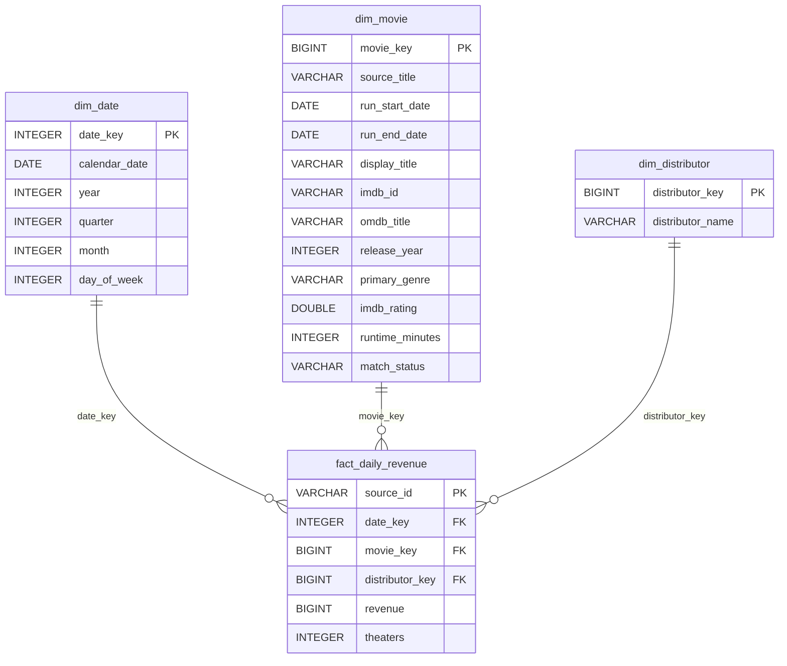
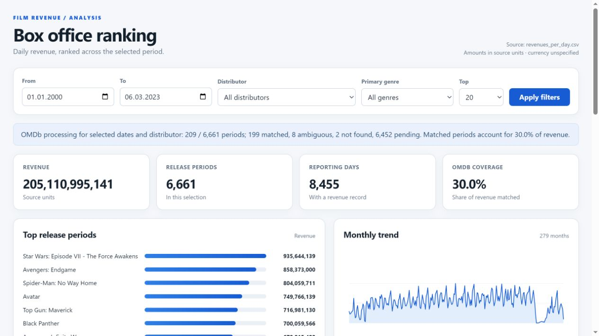

# Daily box office ranking

A local Python + DuckDB pipeline loads daily revenue from `revenues_per_day.csv`, enriches reporting periods with [OMDb](https://www.omdbapi.com/), and serves a ranking dashboard. Verified with Python 3.12.8 and DuckDB 1.5.1.

## Run

On Windows PowerShell:

```powershell
python -m venv .venv
.\.venv\Scripts\python.exe -m pip install -r requirements.txt
.\.venv\Scripts\python.exe -m pipeline.load_revenues
Copy-Item .env.example .env
```

Put your [free OMDb key](https://www.omdbapi.com/apikey.aspx) in `.env` as `OMDB_API_KEY=...`, then run:

```powershell
.\.venv\Scripts\python.exe -m pipeline.enrich_omdb --limit 100
.\.venv\Scripts\python.exe -m dashboard.server
```

Open [http://127.0.0.1:8501/](http://127.0.0.1:8501/). The default database is `data/box_office.duckdb`; both pipeline commands accept `--db`. The CSV loader also accepts `--csv`. Stop the dashboard before a command writes to the same database.

The database and `.env` are ignored by Git. If you already have a database from the earlier version of this project, **keep it**: the simplified pipeline uses its `omdb_lookup` responses and `omdb_request_log`. Reimporting the same CSV retains the matched periods. `python -m pipeline.enrich_omdb --offline` reapplies saved title responses without an API key or new requests when a period needs reclassification. The old optional tables can remain in the database; the simplified pipeline does not depend on them.

## Data and model

The CSV contains **337,818 rows**, **6,545 distinct titles**, **363 distributors**, and **8,455 dates** from **2000-01-01 to 2023-03-06**. Total revenue is **205,110,995,141 source units**; 161 theater counts are missing. The source does not state the currency, market or gross/net basis.

The fact grain is one CSV row for a title, distributor and day. `revenue` is additive. `theaters` is a row-level value and should not be summed as a count of unique cinemas. A title starts a new reporting period after more than 180 days without a revenue record. This is a heuristic for separating likely rereleases or remakes, not proof of film identity.



`raw_revenues` keeps the parsed CSV snapshot. `omdb_lookup` stores the JSON response for each queried period; `omdb_request_log` counts requests toward the safety cap. A saved response for the same source title can be reused for another period, but it is checked again against that period's dates. Only an exact normalized title and plausible release year become `matched`; all fact revenue stays in the model even without a match. The film ranking combines matched periods by IMDb ID. The release-period ranking includes every period.

## Demonstration

The local database on 25 September 2026 had **6,661 periods**: **199 matched**, **8 ambiguous**, **2 not found**, and **6,452 pending**. Matched periods covered **30.03% of source revenue**. This is coverage, not match accuracy. A clean checkout has no saved OMDb responses; `--limit 100` processes the highest-revenue pending periods first. The [free OMDb tier](https://www.omdbapi.com/apikey.aspx) lists 1,000 requests per day; this pipeline caps itself at 900 in a rolling 24-hour window. Use `--daily-cap` to set a lower ceiling.



Across the full source date range, the largest reporting period was **Star Wars: Episode VII - The Force Awakens** at **935,644,139 source units**. In 2019 the leader was **Avengers: Endgame** (858,373,000); in 2022 it was **Top Gun: Maverick** (716,981,130). **Walt Disney Studios Motion Pictures** contributed **17.32%** of revenue across all dates. These statements use the complete fact table; the confirmed-film ranking is limited by OMDb coverage.

## Verify

```powershell
.\.venv\Scripts\python.exe -m unittest discover -s tests -v
```

The import checks required fields, duplicate IDs and duplicate date/title/distributor groups, then reconciles fact count, total revenue and missing theater counts with the CSV in one transaction. Reloads preserve saved OMDb responses and reject a change that moves already-enriched source rows to a different reporting period. OMDb metadata is user-maintained and title matching can be wrong, so ambiguous periods remain separate.
