# Daily box office warehouse

This repository loads and validates `revenues_per_day.csv` into a DuckDB
dimensional model, enriches movies through OMDb, and presents a ranking dashboard.

## Run

On Windows PowerShell:

```powershell
python -m venv .venv
.\.venv\Scripts\python.exe -m pip install -r requirements.txt
.\.venv\Scripts\python.exe -m pipeline.load_revenues
.\.venv\Scripts\python.exe -m unittest discover -s tests -v
```

The default database is `data/box_office.duckdb`. Pass `--csv` and `--db` to use
other paths. The loader can be rerun: it replaces the raw and fact snapshot in
one transaction, while existing movie enrichment columns are retained. An
unambiguous extension of a reporting period retains its `movie_key`, even if
an earlier revenue date is added. A split or merge involving a reviewed period
aborts the import and leaves the previous snapshot intact for human review.
To upgrade
an earlier database that used one row per title, stop the dashboard and run
`.\.venv\Scripts\python.exe -m pipeline.migrate_runs`. This saves a dated
database backup and reuses all stored OMDb responses without API requests.
For an existing run-based warehouse, build the film dimension from saved IMDb
assignments without reloading CSV or calling OMDb. This also restores missing
active `dim_release_run` rows from the older run-based model and checks that
all facts and confirmed IMDb assignments remain linked:

```powershell
.\.venv\Scripts\python.exe -m pipeline.film_identity
```

## Data model

The fact grain is one source CSV record for one title, distributor and day.
`source_id` is the source primary key. Revenue is additive across those records;
theater counts are nullable and should not be interpreted as unique cinemas
when summed across movies.

```mermaid
erDiagram
    dim_date ||--o{ fact_daily_revenue : date_key
    dim_movie ||--o{ fact_daily_revenue : movie_key
    dim_movie ||--o| dim_release_run : movie_key
    dim_movie ||--o| v_run_film_match : movie_key
    dim_film ||--o{ v_run_film_match : film_key
    dim_film ||--o| film_details : film_key
    dim_distributor ||--o{ fact_daily_revenue : distributor_key
    dim_movie ||--o| omdb_lookup : movie_key
    dim_movie ||--o{ omdb_candidate : movie_key
    dim_movie ||--o{ omdb_search_cache : movie_key
    dim_movie ||--o| movie_match_decision : movie_key
    dim_movie ||--o{ run_boundary_change_log : movie_key
    dim_date {
        INTEGER date_key PK
        DATE calendar_date
        INTEGER year
        INTEGER quarter
        INTEGER month
        INTEGER day_of_week
    }
    dim_movie {
        BIGINT movie_key PK
        VARCHAR source_title
        DATE run_start_date "original identity anchor"
        DATE run_end_date "original identity anchor"
        VARCHAR display_title "original identity anchor"
        VARCHAR imdb_id
        VARCHAR omdb_title
        INTEGER release_year
        VARCHAR primary_genre
        DOUBLE imdb_rating
        INTEGER runtime_minutes
        VARCHAR match_status
    }
    dim_distributor {
        BIGINT distributor_key PK
        VARCHAR distributor_name
    }
    fact_daily_revenue {
        VARCHAR source_id PK
        INTEGER date_key FK
        BIGINT movie_key FK
        BIGINT distributor_key FK
        BIGINT revenue
        INTEGER theaters
    }
    dim_release_run {
        BIGINT movie_key PK,FK
        DATE run_start_date
        DATE run_end_date
        VARCHAR display_title
    }
    dim_film {
        BIGINT film_key PK
        VARCHAR imdb_id UK
    }
    film_details {
        BIGINT film_key PK,FK
        VARCHAR film_title
        INTEGER release_year
        VARCHAR primary_genre
        DOUBLE imdb_rating
        INTEGER runtime_minutes
    }
    v_run_film_match {
        BIGINT movie_key
        BIGINT film_key
    }
    omdb_lookup {
        BIGINT movie_key PK,FK
        VARCHAR lookup_status
        VARCHAR candidate_imdb_id
        VARCHAR candidate_title
        VARCHAR match_reason
        VARCHAR response_json
        TIMESTAMP fetched_at_utc
    }
    omdb_candidate {
        BIGINT movie_key PK,FK
        VARCHAR imdb_id PK
        VARCHAR candidate_title
        VARCHAR candidate_year
        VARCHAR search_title
        INTEGER year_hint
        VARCHAR detail_json
        TIMESTAMP discovered_at_utc
    }
    omdb_search_cache {
        BIGINT movie_key PK,FK
        VARCHAR search_title PK
        INTEGER year_hint PK
        VARCHAR response_json
        TIMESTAMP fetched_at_utc
    }
    title_search_alias {
        VARCHAR source_title PK
        VARCHAR search_title PK
        VARCHAR reason
        TIMESTAMP created_at_utc
    }
    movie_match_decision {
        BIGINT movie_key PK,FK
        VARCHAR decision
        VARCHAR imdb_id
        VARCHAR reason
        TIMESTAMP reviewed_at_utc
    }
    run_boundary_change_log {
        VARCHAR change_id PK
        BIGINT movie_key FK
        DATE old_start_date
        DATE old_end_date
        DATE new_start_date
        DATE new_end_date
        VARCHAR previous_match_status
        TIMESTAMP changed_at_utc
    }
    title_boundary_rule {
        VARCHAR source_title PK
        DATE boundary_date PK
        VARCHAR action
        VARCHAR reason
        TIMESTAMP reviewed_at_utc
    }
    title_boundary_rule_event {
        VARCHAR event_id PK
        VARCHAR source_title
        DATE boundary_date
        VARCHAR previous_action
        VARCHAR new_action
        VARCHAR reason
        TIMESTAMP changed_at_utc
    }
```



`raw_revenues` retains the original six CSV fields with parsed dates and
numbers. `dim_movie` holds the stable provisional key and the dates from its
first import. `dim_release_run` holds the current reporting dates and label;
it changes when source data expands, without changing the movie key.
`dim_film` has one identity per confirmed IMDb ID. `v_run_film_match` links
active periods to that identity, so a rerelease can add to the same film's
revenue while a remake with a different IMDb ID stays separate. `film_details`
contains the best available descriptive metadata. Unresolved periods have no
film identity yet.
A gap of more than 180 days between reported revenue dates starts a new period;
the initial identity anchor is `(source_title, run_start_date)`. This separates
likely remakes and rereleases for review. A rerelease of the *same* film can
have a separate row but share its IMDb ID. Conversely, two releases with a
shorter gap can remain combined; the dates alone cannot prove identity.

The CSV does not identify a currency, market or gross/net basis. The model
therefore stores `revenue` without claiming a currency. The literal `-` in a
distributor name is preserved as source data.

## Current source reconciliation

For the provided CSV, the expected output is 337,818 fact rows, 6,545 distinct
source titles, 363 distributors, 8,455 dates, total revenue 205,110,995,141
and 161 missing theater counts. The number of movie dimension rows is higher
than the number of titles because some titles have multiple reporting periods.
These values are calculated by the loader, not hard coded into it.

## OMDb enrichment

Register a free OMDb key and put `OMDB_API_KEY=your_key` in `.env` (ignored by
Git), or set it as an environment variable. Then run:

```powershell
.\.venv\Scripts\python.exe -m pipeline.enrich_omdb --limit 2 --daily-cap 2
```

The default run limit is only **two requests**. The hard maximum is 900
requests over any rolling 24-hour period, leaving room below OMDb's published
1,000-per-day free limit. `--daily-cap` can lower the limit for tests but cannot
raise it above 900. A request is recorded *before* it is sent, so a crash or
network failure still counts conservatively. Successful lookups and errors are
stored in `omdb_lookup`; every attempt is recorded in `omdb_request_log`.

Pending title periods are processed in descending total-revenue order. A returned
movie is accepted only when its normalized title matches, it has an IMDb ID,
and its release year is close to the first revenue year. Titles spanning more
than three calendar years are also flagged for review. Other candidates
are marked `ambiguous` for review rather than merged automatically. Network
errors are marked `retry_later`; rerun them explicitly with `--retry-errors`.
Previous title-not-found responses remain saved until explicitly retried with
`--retry-not-found`. Use `--movie-key` and `--limit 1` to refresh exactly one
selected period. Both options use the shared request budget.
An API quota or key error stops the run and leaves its title pending.
When another period has a saved response for the same title, the pipeline
reclassifies that response against the period's dates without calling OMDb.
Only successful movie responses are reused across periods. Technical API
errors, including invalid-key and quota responses, never serve as title cache
hits; a later run can retry subject to the request budget.

OMDb metadata is kept in the local database, which is ignored by Git. Neither
the API key nor complete request URLs are printed by the pipeline.

## Manual match review

`v_movie_match_review` lists ambiguous matches and titles with more than one
revenue period. It shows the exact period, revenue, saved OMDb candidate and
matching reason. The dashboard includes the first 50 cases; the complete list
is available through the CLI or SQL view. Review decisions are stored per
`movie_key` in `movie_match_decision`, with a required reason and timestamp.

```powershell
.\.venv\Scripts\python.exe -m pipeline.review_matches list --limit 20
.\.venv\Scripts\python.exe -m pipeline.review_matches decide --movie-key 123 --action accept_candidate --reason "Verified release and credits"
.\.venv\Scripts\python.exe -m pipeline.review_matches decide --movie-key 123 --action verify_id --imdb-id tt1234567 --reason "Checked IMDb listing"
.\.venv\Scripts\python.exe -m pipeline.review_matches decide --movie-key 123 --action reject_candidate --reason "Different film with the same title"
.\.venv\Scripts\python.exe -m pipeline.review_matches undo --movie-key 123
```

Replace `123` and `tt1234567` with reviewed values. `accept_candidate`
promotes the saved OMDb response to a match. `verify_id` records a different
confirmed IMDb ID without inventing OMDb metadata; its `verified_id` status
appears in the film ranking but does not count toward OMDb metadata coverage.
`reject_candidate` removes a
previously assigned match. `undo` restores the automatic classification. The
saved response and request log remain unchanged, and these commands never
call OMDb. No decisions are made automatically on behalf of a reviewer.

## Alternative OMDb candidates

For an ambiguous, rejected or unfound run, search by title with its first
revenue year as a hint. Search results are saved as candidates; none is linked
automatically. Use `--broad` to omit the year hint, or `--year` to choose a
different year for one run. Each distinct search consumes at most one API
request; rerunning the same search uses the saved response.
For a saved result that may have become stale, use `--refresh` together with
`--movie-key` to requery exactly one period. A refresh counts as a new request.

```powershell
.\.venv\Scripts\python.exe -m pipeline.search_candidates budget
.\.venv\Scripts\python.exe -m pipeline.search_candidates search --movie-key 123 --limit 1
.\.venv\Scripts\python.exe -m pipeline.search_candidates list --movie-key 123
.\.venv\Scripts\python.exe -m pipeline.review_matches decide --movie-key 123 --action verify_id --imdb-id tt1234567 --reason "Checked title, year and credits"
.\.venv\Scripts\python.exe -m pipeline.search_candidates hydrate --movie-key 123 --limit 1
```

`hydrate` fetches full details only for an IMDb ID chosen by a reviewer. It
does not replace the original title lookup, so `review_matches undo` can
restore the automatic result. The title, search and detail commands share one
rolling 24-hour request log and the same hard 900-request cap. The suggested
`--limit 1` uses at most one request per command. Use `budget` to see current
24-hour usage; `--daily-cap` can restrict the *total* rolling usage further.

For a known alternate spelling, register an alias with a reason before
searching. An alias only changes the OMDb query; source titles, revenue rows
and run identities remain unchanged.

```powershell
.\.venv\Scripts\python.exe -m pipeline.search_candidates aliases set --source-title "Source title" --search-title "OMDb title" --reason "Verified alternate title"
.\.venv\Scripts\python.exe -m pipeline.search_candidates search --movie-key 123 --search-title "OMDb title" --limit 1
.\.venv\Scripts\python.exe -m pipeline.search_candidates aliases list
```

The dashboard review table shows the saved alternatives and their IMDb IDs.

## Manual revenue-period boundaries

The default rule starts a new period after more than 180 days without a
reported revenue date. A reviewer can force a split at an existing revenue
date inside a period, or join two periods at the first date after an automatic
gap. The original source rows remain unchanged. Each command reloads the CSV
in one transaction, records a reason, and keeps a rule for future reloads.

```powershell
.\.venv\Scripts\python.exe -m pipeline.review_boundaries split --source-title "Film" --boundary-date 2020-02-01 --reason "Two distinct releases"
.\.venv\Scripts\python.exe -m pipeline.review_boundaries join --source-title "Film" --boundary-date 2021-01-01 --reason "Same release returned to cinemas"
.\.venv\Scripts\python.exe -m pipeline.review_boundaries list
.\.venv\Scripts\python.exe -m pipeline.review_boundaries remove --source-title "Film" --boundary-date 2020-02-01 --reason "Correction withdrawn after review"
```

`--boundary-date` must be an actual, non-first revenue date for that source
title. The command rejects a rule that would duplicate the automatic result.
If the changed period has a manual IMDb decision, first undo that decision
with `pipeline.review_matches undo`, then apply the boundary correction and
review the resulting periods again. Automatic OMDb matches on structurally
changed periods return to `pending` for re-evaluation. Previous lookup
responses and request history remain stored, and boundary rule changes are
recorded in `title_boundary_rule_event`.

## Matching quality review

The project includes two unlabeled review templates: 30 film periods in
`quality/film_labels.csv` and 20 pairs of revenue dates in
`quality/boundary_labels.csv`. The film sample includes ambiguous, multiple
period, matched and pending cases. The boundary sample includes pairs on both
sides of the current 180-day rule. These are deliberately selected cases, not
a random sample of all films.

For each film period, a reviewer enters the verified IMDb ID in
`expected_imdb_id` and a source or explanation in `review_notes`. For each date
pair, enter `true` or `false` in `expected_same_period`. A rerelease can be
the same film while belonging to a different reporting period, so review
period membership separately from film identity.

```powershell
.\.venv\Scripts\python.exe -m pipeline.evaluate_matching evaluate
```

The evaluator reports IMDb precision and recall on labeled cases, the share
of labeled revenue assigned to the correct ID, and counts of false joins and
splits among labeled date pairs. Empty labels are excluded; until cases are
reviewed, metrics are `null`, not zero. To create a new template from a new
warehouse snapshot, run `python -m pipeline.evaluate_matching sample`. This
refuses to overwrite existing labels unless `--force` is supplied.

## Ranking dashboard

Run the dashboard after loading the CSV:

```powershell
.\.venv\Scripts\python.exe -m dashboard.server
```

Open `http://127.0.0.1:8501/` in a browser. The dashboard uses Python's
standard HTTP server and DuckDB; no additional web packages are required.

The dashboard ranks confirmed films, all release periods and distributors,
and shows monthly revenue trends. The film ranking combines the revenue of
periods linked to the same IMDb ID; the period ranking retains unresolved data.
It also displays a read-only match-review queue with `movie_key` values for
recording decisions through the CLI.
Date and distributor filters use the full fact table, including films without
OMDb metadata. The genre filter uses only matched titles; the displayed OMDb
revenue coverage shows how much of the current date/distributor selection has
metadata. Revenue values are shown in source units because the CSV does not
identify a currency. Close the dashboard before running a loader that writes
to the same DuckDB file.
