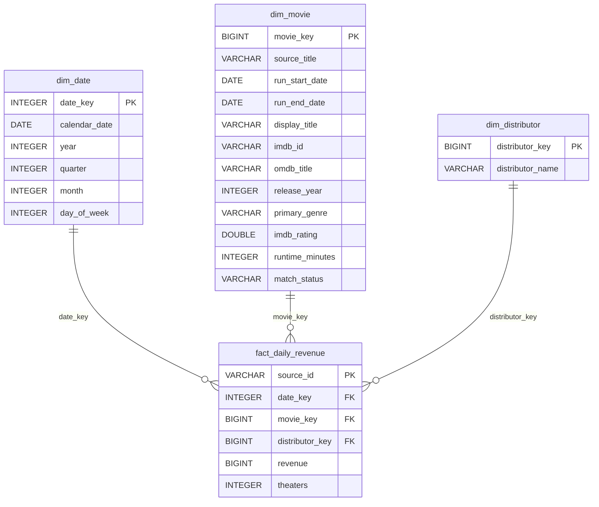

# Daily box office ranking

A local Python + DuckDB pipeline loads daily revenue from `revenues_per_day.csv`, enriches reporting periods with [OMDb](https://www.omdbapi.com/), and serves a ranking dashboard. Verified with Python 3.12.8 and DuckDB 1.5.1.

## Run

On Windows PowerShell:

```powershell
python -m venv .venv
.\.venv\Scripts\python.exe -m pip install -r requirements.txt
.\.venv\Scripts\python.exe -m pipeline.load_revenues
Copy-Item .env.example .env
```

Put your [free OMDb key](https://www.omdbapi.com/apikey.aspx) in `.env` as `OMDB_API_KEY=...`, then run:

```powershell
.\.venv\Scripts\python.exe -m pipeline.enrich_omdb --limit 100
.\.venv\Scripts\python.exe -m dashboard.server
```

Open [http://127.0.0.1:8501/](http://127.0.0.1:8501/). The default database is `data/box_office.duckdb`; both pipeline commands accept `--db`. The CSV loader also accepts `--csv`. Stop the dashboard before a command writes to the same database.

The database and `.env` are ignored by Git. Reimporting the same CSV retains matched periods, saved OMDb responses and the request history. `python -m pipeline.enrich_omdb --offline` reuses saved title responses for eligible periods without an API key or new requests.

## Data and model

The CSV contains **337,818 rows**, **6,545 distinct titles**, **363 distributors**, and **8,455 dates** from **2000-01-01 to 2023-03-06**. Total box office gross is **$205,110,995,141**; 161 theater counts are missing. The CSV has no explicit currency or market metadata, but its **Avengers: Endgame** rows sum to **$858,373,000**, matching the published [domestic theatrical gross](https://www.boxofficemojo.com/title/tt4154796/) exactly. The dashboard therefore treats `revenue` as nominal **USD domestic theatrical box office gross**, covering the **US and Canada** ([Box Office Mojo's definition](https://www.boxofficemojo.com/article/ed3547792388/)). It is ticket sales, not distributor profit or worldwide revenue. This interpretation has not been verified for every CSV row.

The fact grain is one CSV row for a title, distributor and day. `revenue` is additive. `theaters` is a row-level value and should not be summed as a count of unique cinemas. A title starts a new reporting period after more than 180 days without a revenue record. This is a heuristic for separating likely rereleases or remakes, not proof of film identity.



`raw_revenues` keeps the parsed CSV snapshot. `omdb_lookup` stores the JSON response for each queried period; `omdb_request_log` counts requests toward the safety cap. A saved response for the same source title can be reused for another period, but it is checked again against that period's dates. Only an exact normalized title and plausible release year become `matched`; all fact revenue stays in the model even without a match. The film ranking combines matched periods by IMDb ID. The release-period ranking includes every period.

Examples of ambiguous matches in the saved OMDb responses include **The Lion King** (2019 revenue versus a 1994 OMDb candidate), **Legally Blonde 2** (shortened source title versus the longer OMDb title, *Legally Blonde 2: Red, White & Blonde*), and **American Sniper** (revenue starting in December 2014 versus an OMDb year of 2015). These cases illustrate title collisions, title variations, and release-year discrepancies. Their revenue remains in the model, but OMDb metadata is not assigned automatically. Conservative matching can also reject valid candidates; these cases require review rather than automatic acceptance.

## Demonstration

The local database on 25 September 2026 had **6,661 periods**, of which **908 had been processed**: **863 matched**, **34 ambiguous**, **11 not found**, and **5,753 pending**. Matched periods covered **65.77% of source revenue**. This is coverage, not match accuracy.

Enrichment is intentionally partial due to the free OMDb API request limit. Subsequent runs continue processing pending titles while reusing cached responses. All CSV revenue records are loaded regardless of enrichment status. A clean checkout has no saved OMDb responses; `--limit 100` processes the highest-revenue pending periods first. The [free OMDb tier](https://www.omdbapi.com/apikey.aspx) lists 1,000 requests per day; this pipeline caps itself at 900 in a rolling 24-hour window. Use `--daily-cap` to set a lower ceiling.

Across the full source date range, the largest reporting period was **Star Wars: Episode VII - The Force Awakens** at **$935,644,139**. In 2019 the leader was **Avengers: Endgame** ($858,373,000); in 2022 it was **Top Gun: Maverick** ($716,981,130). **Walt Disney Studios Motion Pictures** contributed **17.32%** of gross across all dates. These statements use the complete fact table; the confirmed-film ranking is limited by OMDb coverage.

Each ranking can be sorted independently by its visible columns in either direction. Sorting runs before the selected Top 10/20/50/100 limit, so the tables and their CSV exports reflect the full filtered dataset. The Top release periods chart always shows the ten highest grosses.

## Analytical observations

The following observations use all revenue records in the fact table, regardless of OMDb match status:

- **Pandemic-era decline:** recorded gross fell from **$11.21 billion in 2019** to **$1.98 billion in 2020**, a decline of **82.3%**. The monthly series drops sharply in March and reaches just **$34,369 in April 2020**. The timing is consistent with disruption during the COVID-19 pandemic, but the CSV alone does not establish causation or completeness of market coverage.
- **Gradual recovery:** recorded gross increased to **$4.07 billion in 2021** and **$7.27 billion in 2022**. The 2022 total remained **35.1% below 2019**, in nominal terms without inflation adjustment.
- **Seasonality:** across 2000-2019, July had the highest average recorded daily gross (**$36.82 million**), followed by June (**$32.48 million**) and December (**$30.84 million**). Comparing daily averages accounts for differences in month length. The largest monthly total in the dataset was **July 2011: $1,380,301,220**.
- **Incomplete final month:** the dataset ends on **6 March 2023**, so the last chart point contains only six days (**$136.25 million**). It should not be compared directly with full monthly totals or interpreted as another market collapse.

## Verify

```powershell
.\.venv\Scripts\python.exe -m unittest discover -s tests -v
```

The import checks required fields, duplicate IDs and duplicate date/title/distributor groups, then reconciles fact count, total revenue and missing theater counts with the CSV in one transaction. Reloads preserve saved OMDb responses and reject a change that moves already-enriched source rows to a different reporting period. OMDb metadata is user-maintained and title matching can be wrong, so ambiguous periods remain separate.
