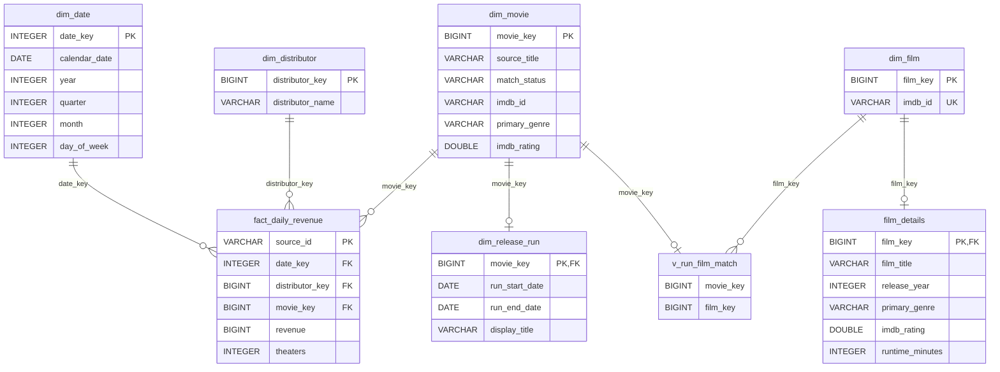
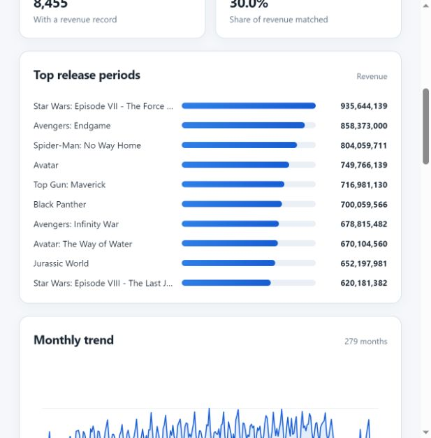

# Daily box office ranking

A small local pipeline loads `revenues_per_day.csv` into DuckDB, adds film metadata from [OMDb](https://www.omdbapi.com/), and serves a ranking dashboard. Python 3.12.8 and DuckDB 1.5.1 were used to verify this project.

## Source and API

The CSV has six columns: `id`, `date`, `title`, `revenue`, `theaters`, `distributor`. It contains **337,818 records**, **6,545 source titles**, **363 distributors**, and **8,455 reporting dates** from **2000-01-01 to 2023-03-06**. Total revenue is **205,110,995,141 source units**; `theaters` is missing in 161 records. The file does not state the currency, market, or gross/net basis. A distributor value of `-` remains a literal source value.

OMDb supports lookup by title (`t`) or IMDb ID (`i`) and returns fields such as `imdbID`, `Title`, `Year`, `Genre`, `imdbRating`, and `Runtime` in JSON. Its [free key form](https://www.omdbapi.com/apikey.aspx) currently states a limit of 1,000 requests per day. The pipeline uses at most 900 requests in a rolling 24-hour window and stores responses locally.

## Analytical model

**Fact grain:** one CSV row for one title, distributor, and date. `source_id` is the source `id`. `revenue` can be summed across fact rows. `theaters` is a count for that row and must not be summed as a count of unique cinemas across titles or days.



`dim_movie` is a provisional **source reporting period**, not necessarily a distinct production. A gap of more than 180 days between revenue dates starts another period for the same title. This is a practical heuristic, not proof of film identity. `dim_release_run` holds its current dates. Once matched, several periods can point through `v_run_film_match` to one `dim_film` identified by IMDb ID; `film_details` stores its descriptive OMDb data. Unmatched periods keep all their fact revenue and remain visible in the release-period ranking. `v_run_film_match` is a SQL view; the other boxes are tables. The full technical schema, including API cache and review tables, is in `sql/schema.sql` and `sql/omdb.sql`.

## Run from a clean checkout

On Windows PowerShell:

```powershell
python -m venv .venv
.\.venv\Scripts\python.exe -m pip install -r requirements.txt
.\.venv\Scripts\python.exe -m pipeline.load_revenues
Copy-Item .env.example .env
```

Register a free key using the [OMDb form](https://www.omdbapi.com/apikey.aspx), then put it in `.env` as `OMDB_API_KEY=...`. If you already have a key, use that one. `.env` is ignored by Git. The registration form requires your email and key activation, so a new checkout cannot acquire a key automatically.

```powershell
# Small integration check: at most two requests.
.\.venv\Scripts\python.exe -m pipeline.enrich_omdb --limit 2

# Optional larger demo: process high-revenue periods first, up to 200 requests.
.\.venv\Scripts\python.exe -m pipeline.enrich_omdb --limit 200 --daily-cap 250

.\.venv\Scripts\python.exe -m dashboard.server
```

Open [http://127.0.0.1:8501/](http://127.0.0.1:8501/). The CSV loader checks the source, builds the dimensions and fact table, and can be rerun. The OMDb step prioritizes periods by revenue and can also be rerun: saved successful responses are reused where appropriate. The request budget is shared with the optional search tools. Stop the dashboard before writing to the same DuckDB file.

The committed CSV reproduces the fact counts, but the enriched DuckDB file is intentionally **not committed**. The exact OMDb results depend on the key, API availability and time of execution. The commands above reproduce the workflow and a comparable demonstration scope, not an identical cache snapshot.

## Demonstration results

On 25 September 2026, the local database contained **6,661 reporting periods**: **198 matched**, **6 ambiguous**, **2 not found**, and **6,455 pending**. Matched periods covered **30.03% of total revenue**. This is coverage, **not** a measure of match accuracy. The dashboard shows these status counts and revenue coverage for the selected dates and distributor. The genre filter works only for matched periods. The confirmed-film ranking therefore cannot be read as a ranking of every film in the CSV.




For the full source date range (2000-01-01–2023-03-06), the largest reporting period was **Star Wars: Episode VII - The Force Awakens**, at **935,644,139 source units**. The leader for 2019 was **Avengers: Endgame** (858,373,000), while for 2022 it was **Top Gun: Maverick** (716,981,130); these are sums of records whose reporting dates fall within each year. Across all dates, **Walt Disney Studios Motion Pictures** contributed **17.32%** of source revenue. These results use the complete fact table; the film-identity ranking is limited by OMDb coverage.

The 12 highest-revenue periods were inspected against their saved OMDb title, release year, IMDb ID, and first revenue date. The fields were consistent for those cases. This spot check is deliberately small and does not establish accuracy for the full dataset; `The Lion King` (2019 period) remains flagged as ambiguous rather than accepted from a same-title response.

## Checks and limits

```powershell
.\.venv\Scripts\python.exe -m unittest discover -s tests -v
```

The test suite covers loading, enrichment classification and request budgeting, film identity, and dashboard queries. The import reconciles fact count and total revenue with the CSV. OMDb matching relies on title and release year; remakes, alternate titles, and rereleases can need human review. The optional review and migration commands are documented in [ADVANCED.md](ADVANCED.md). The historical analysis of reporting-period rules is in [ANALIZA_ROZDZIELANIA_FILMOW.md](ANALIZA_ROZDZIELANIA_FILMOW.md).
